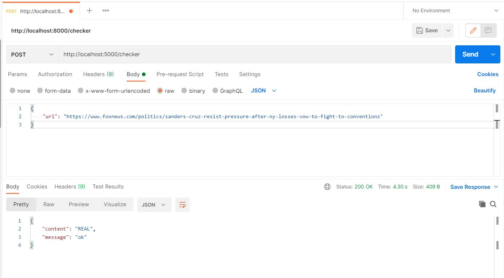
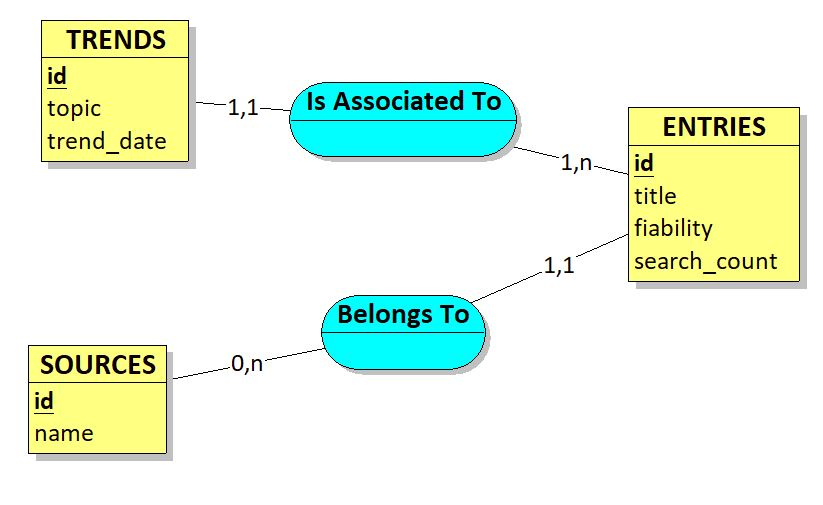

# FIAbility API

## Back-end

For the back-end, we chose to use Flask as our web API framework because some of use have already been using it on previous projects and because there are lots of useful Python libraries to process data.

### Architecture
    |── ai                                                     <- AI-related tools folder
    |    |
    |    ├── dataset                                           <- Test dataset folder
    |    |   |
    |    |   └── fake_or_real_news_test.csv                    <- Test dataset CSV file
    |    |
    |    ├── pickle                                            <- Pickle format serialized model folder
    |    |   |
    |    |   └── pipeline.pkl                                  <- Serialized model
    |    |
    |    └── prediction_model.py                               <- Model class with pre-processing 
    |                                                             and prediction utils
    |
    |── db                                                     <- database scripts folder
    |   |
    |   └── mysql_db.sql                                       <- MySQL database SQL creation script
    |
    |── entities                                               <- Data and model entities folder
    |   |
    |   |── data                                               <- Data entities folder
    |   |   |
    |   |   |── EntryData.py                                   <- Class used for data transfer
    |   |   |                                                     regarding entries
    |   |   |
    |   |   |── SourceData.py                                  <- Class used for data transfer 
    |   |   |                                                     regarding sources
    |   |   |
    |   |   └── TrendData.py                                   <- Class used for data transfer 
    |   |                                                         regarding trends
    |   |
    |   └── models                                             <- Model entities folder
    |       |
    |       |── BaseModel.py                                   <- Base model class, instanciates 
    |       |                                                     the database connection
    |       |
    |       |── Entry.py                                       <- Inherits the BaseModel class, 
    |       |                                                     interacts with the entries table
    |       |
    |       |── Source.py                                      <- Inherits the BaseModel class, 
    |       |                                                     interacts with the sources table
    |       |
    |       └── Trend.py                                       <- Inherits the BaseModel class, 
    |                                                             interacts with the trends table
    |
    |── images                                                 <- Application screens used 
    |                                                             in documentation 
    |
    |── repositories                                           <- Contains the repository files 
    |                                                             that call the models
    |   |
    |   |── entry_repository.py                                <- Interacts with the entry model
    |   |                                                         (entries database table)
    |   |
    |   |── source_repository.py                               <- Interacts with the source model 
    |   |                                                         (sources database table)
    |   |
    |   └── trend_repository.py                                <- Interacts with the trend model 
    |                                                             (trends database table)
    |
    |── routes                                                 <- Contains the FIability API endpoints
    |   |
    |   |── checker_route.py                                   <- User input URL checker, returns whether
    |   |                                                         the articles was labeled as truthful or not
    |   |
    |   └── entries_route.py                                   <- Top four trends and past three latest
    |                                                             fake news retrieval
    |
    |
    |── services                                               <- Folder containing services 
    |   |                                                         called by the endpoints
    |   |
    |   ├── checker_service.py                                 <- Checks an input truthfulness and saves its 
    |   |                                                         source, its entry and its trend
    |   |
    |   ├── constants_service.py                               <- Contains functions to get 
    |   |                                                         the applications's contants
    |   |
    |   ├── crawler_service.py                                 <- Extracts an article from the provided URL
    |   |
    |   ├── entries_service.py                                 <- Top four trends and past three latest
    |   |                                                         fake news retrieval
    |   |
    |   ├── request_service.py                                 <- Determines the request validity and gets 
    |   |                                                         a conditional error message if needed
    |   |
    |   └── response_service.py                                <- Returns a Flask Response, whether it is a 
    |                                                             message-only or a content response
    |
    |── tests                                                  <- Tests folder
    |   |
    |   ├──  unit                                              <- Unit tests
    |   |
    |   └── integration                                        <- Integration tests
    |
    |── .gitignore                                             <- Specifices files / folders to be ignored
    |                                                             by Git's version control
    |
    ├── app.py                                                 <- Application entry point
    |
    ├── gitlab-ci.yml                                          <- Application GitLab workflows
    |
    |
    ├── Dockerfile                                             <- Backend dokerfile 
    |
    |
    ├── nltk.txt                                               <- Python buildpack support file for 
    |                                                             downloading NLTK data files on Heroku
    |
    ├── poetry.lock                                            <- Poetry file which allows locking the
    |                                                             project to its specific used versions
    |
    ├── Procfile                                               <- File that specifies the commands 
    |                                                             that are executed by the app on startup
    |                                                             on the Heroku platform
    |
    ├── pyproject.toml                                         <- Poetry file which contains informations
    |                                                             about the project
    |                                                             and the dependencies it uses
    |
    └── README.md                                              <- Project description file with documentation

### Installation

After cloning this GitHub repository in your local file system, please make sure you have the following requirements fulfilled on your host machine :

- Python version >= 3.9

- The [Poetry dependency manager](https://python-poetry.org/docs/) command line tool

When everything's in place, run the following command to install the project's dependencies with Poetry :

```shell
poetry install
```

### Getting started

Before running the application, please make sure you have correctly set the ```FIABILITY_DB_NAME```, ```FIABILITY_DB_USER```, ```FIABILITY_DB_PASSWORD```, ```FIABILITY_DB_HOST``` and ```FIABILITY_DB_PORT``` environment variables in a ```.env``` file at the root of the application (this file is ignored by version control in the .gitignore for security purposes). 

Also make sure to have correctly set the ```FLASK_RUN_HOST``` and ```FLASK_RUN_PORT``` environment variables (also in the ```.env``` file) which will be used by the Flask runtime to launch the server. These environment variables are specific to Flask (see the [Flask CLI documentation](https://flask.palletsprojects.com/en/2.0.x/cli/)). 

In our example the first one will take the value ```0.0.0.0``` (to be accessible by external clients) and the second one ```5000```.

To run the application, you have to prefix the flask run command by ```poetry run```. Example :

```shell
poetry run flask run
```

The above command launches the Flask web server which will be listening on port 5000 on localhost (and will be accessible to external clients as well).

Then, you can make requests to the checker endpoint for example, with the following structure :

```
POST http://host:port/checker
```

with the following body structure in JSON format :

```json
{
    "url": "https://www.example.com"
}
```

The server's reponse will be a response object containing a message and the direct output of the entry truthfulness checker (with JSON content type) between the following values : ```REAL``` and ```FAKE```.

Example :



## Database

The database is hosted on Heroku and consist of a MySQL instance against which SQL queries will be run via the [peewee ORM](http://docs.peewee-orm.com/en/latest/) via the PyMysql driver.

Currently, the CDM looks like the following :



## Tests

Unit tests and integration tests have been implemented for the back-end application.

Before running them, make sure to have correctly set the ```FIABILITY_HOST``` environment variable in the ```.env``` file which is the host name or IP address that will be targeted by test requests (here in our example it will be set to ```localhost```). Afterwards, start the server as the integration tests will send requests to the endpoints.

**IMPORTANT** : be aware that the ```FIABILITY_HOST``` and ```FLASK_RUN_HOST``` environment variables are destined to two different use cases (the first one for the integration tests and the second one for the Flask runtime) and are therefore to be distinguished from each other and to be individually set.

To run the tests, type the following command at the root of the application folder :

```shell
poetry run python -m pytest . --disable-warnings
```

Here, we disable pytest warning outputs because it is due to a package version conflict coming from the pickle.

## Virtualization

Application is virtualized through docker. 

You can build, and run application locally as follows:

- Move to the root application folder

- Execute
```
docker build - t fiability-back .
docker run -p 5000:5000 fiability-back
```

If you want to release the docker image to Docker Hub repository:

````
docker build -t fiability-back .
docker push $DOCKER_REPOSITORY:latest
````

where ``` $DOCKER_REPOSITORY``` is as follows dockerhub_username/repository_name

## Project members

Lilian TEL

Thabisan THAVANESAN

Mouna HARBAOUI

Hugo TANG

Brunelle MALANDILA LEYA

Wiem CHOUCHANE

M2 APP