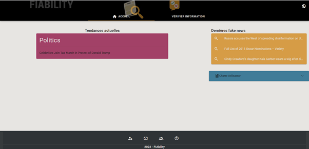
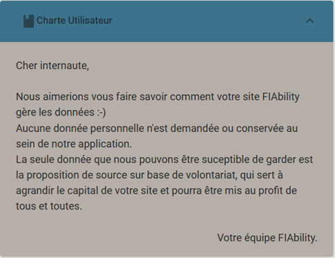
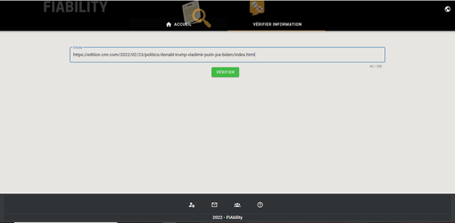
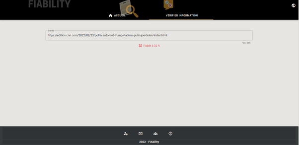
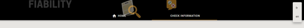
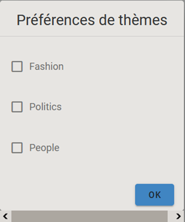
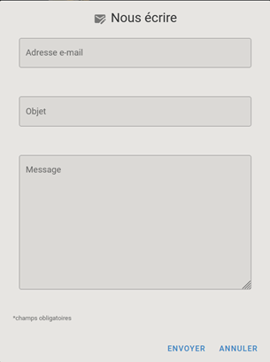
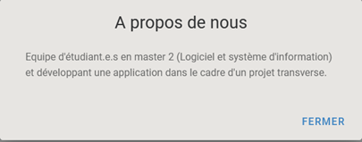

# FIAbility API Release Notes

## [v1.0](https://gitlab.com/Nellemanette/fiability-back)

* Vizualize current search trends
* Vizualize latest fake news
* Switch UI languages between french and english
* Send e-mail to team members (contact)
* User charter
* Help section
* About us section
* Get URL input fiability percentage estimation
* Set user theme preferencies

